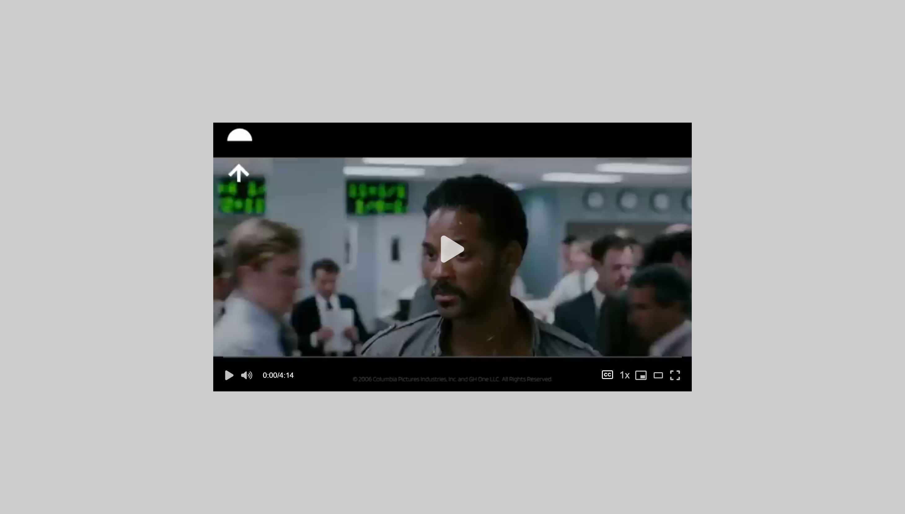

### **Customized Video Player**

**Live demo** [click here]('https://customized-video.netlify.app")

### **Description:**

This **Customized Video Player** is an advanced media player built with **Native JavaScript** and **CSS**, offering a range of modern functionalities for an enhanced viewing experience. It is designed to provide users with complete control over video playback in a feature-rich yet user-friendly environment.

---

### **Key Features:**

1. **Playback Control:**

    - Adjust playback **speed** to slow down or speed up the video.
    - Toggle **mute** and control the **sound level** with a slider for precise volume adjustments.

2. **Captions Support:**

    - Easily enable or disable **subtitles/captions** for supported videos.

3. **Theatre Mode:**

    - Switch to **theatre mode** for a more immersive viewing experience with a darkened background.

4. **Full-Screen Mode:**

    - Toggle **full mode** for distraction-free playback on the entire screen.

5. **Interactive Progress Bar:**

    - Displays **image frames** as users hover over the progress bar, offering a preview of the video at any given point.

6. **Time Display:**

    - Shows the **current time** and **total duration** of the video, updated dynamically as the video progresses.

7. **Responsive Design:**
    - Adapts seamlessly to different screen sizes for an optimal user experience on all devices.

---

### **Technologies Used:**

-   **HTML5 Video API**
-   **CSS3**
-   **JavaScript**
